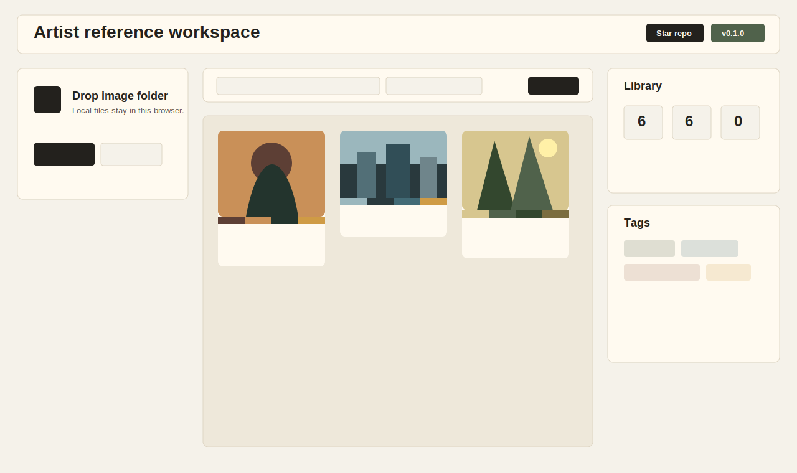
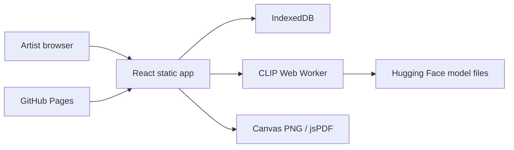

# Reference Photo Organizer

Live site: https://baditaflorin.github.io/reference-photo-organizer/

Repository: https://github.com/baditaflorin/reference-photo-organizer

Support: https://www.paypal.com/paypalme/florinbadita

Browser-based artist reference board with local image tagging, palettes, collages, and PNG/PDF export.



## Why

Reference Photo Organizer gives artists a local-first replacement for lightweight PureRef, Eagle, and Milanote reference workflows: drop an image folder, get palettes and content tags, arrange a board, and export a PNG mood-board or PDF reference sheet.

## Quickstart

```bash
npm install
make install-hooks
make dev
```

## Checks

```bash
make lint
make test
make smoke
```

## Architecture

Mode A: Pure GitHub Pages. There is no runtime backend, no account system, no database server, and no frontend secrets.



## Documentation

Architecture: docs/architecture.md

Deployment: docs/deploy.md

Privacy: docs/privacy.md

ADRs: docs/adr/

Postmortem: docs/postmortem.md

## Version

The published page displays the package version and build commit in the header.
