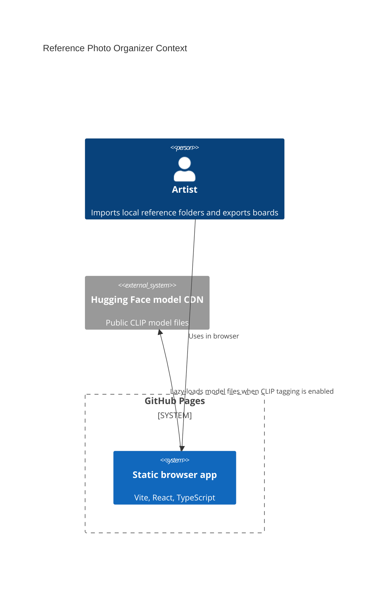
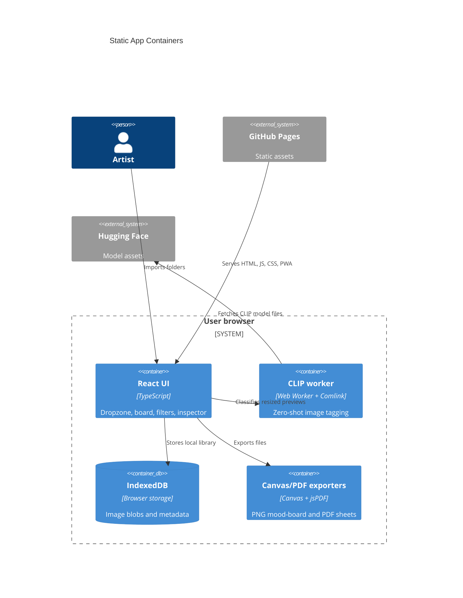

# Architecture

Live URL: https://baditaflorin.github.io/reference-photo-organizer/

Repository: https://github.com/baditaflorin/reference-photo-organizer

## Context

```mermaid
C4Context
  title Reference Photo Organizer Context
  Person(artist, "Artist", "Imports local reference folders and exports boards")
  System_Boundary(pages, "GitHub Pages") {
    System(app, "Static browser app", "Vite, React, TypeScript")
  }
  System_Ext(hf, "Hugging Face model CDN", "Public CLIP model files")
  Rel(artist, app, "Uses in browser")
  Rel(app, hf, "Lazy-loads model files when CLIP tagging is enabled")
```

## Containers

```mermaid
C4Container
  title Static App Containers
  Person(artist, "Artist")
  System_Boundary(browser, "User browser") {
    Container(ui, "React UI", "TypeScript", "Dropzone, board, filters, inspector")
    Container(worker, "CLIP worker", "Web Worker + Comlink", "Zero-shot image tagging")
    ContainerDb(idb, "IndexedDB", "Browser storage", "Image blobs and metadata")
    Container(canvas, "Canvas/PDF exporters", "Canvas + jsPDF", "PNG mood-board and PDF sheets")
  }
  System_Ext(pages, "GitHub Pages", "Static assets")
  System_Ext(hf, "Hugging Face", "Model assets")
  Rel(artist, ui, "Imports folders")
  Rel(ui, idb, "Stores local library")
  Rel(ui, worker, "Classifies resized previews")
  Rel(worker, hf, "Fetches CLIP model files")
  Rel(ui, canvas, "Exports files")
  Rel(pages, ui, "Serves HTML, JS, CSS, PWA")
```
